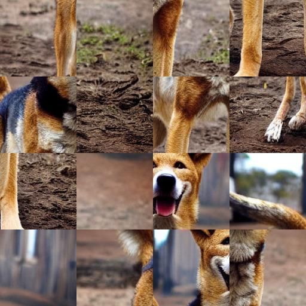
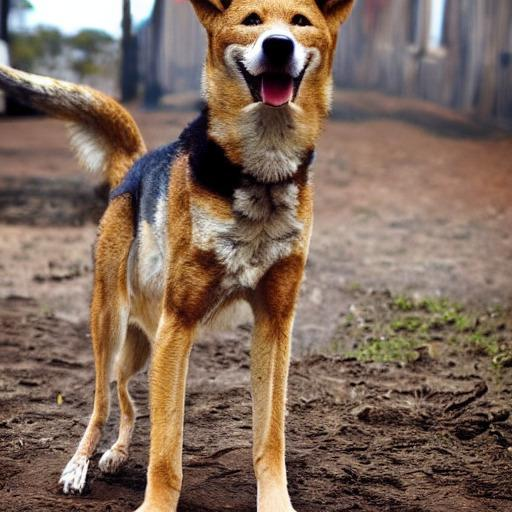

# Square puzzle

 |  |
---| ---| 

- 정답 이미지와 뒤섞인 이미지를 4X4로 16등분해 정사각형 이미지를 ```data``` 폴더에 저장합니다.
- **[imagededup](https://github.com/idealo/imagededup)** &rarr; ```data``` 폴더 안에서 동일한 이미지를 찾아냅니다.
    ```
    {'origin_part_1.jpg': [('split_part_12.jpg', 0.9999883)], 'origin_part_10.jpg': [('split_part_7.jpg', 0.9999999)], 'origin_part_11.jpg': [('split_part_3.jpg', 1.0000002)], 'origin_part_12.jpg': [('split_part_2.jpg', 0.9999999)], 'origin_part_13.jpg': [('split_part_8.jpg', 0.9999987)], 'origin_part_14.jpg': [('split_part_4.jpg', 0.99999976)], 'origin_part_15.jpg': [('split_part_9.jpg', 0.99999607)], 'origin_part_16.jpg': [('split_part_6.jpg', 0.9999895)], 'origin_part_2.jpg': [('split_part_15.jpg', 0.9999995)], 'origin_part_3.jpg': [('split_part_11.jpg', 0.9999791)], 'origin_part_4.jpg': [('split_part_13.jpg', 1.0000002)], 'origin_part_5.jpg': [('split_part_14.jpg', 0.9999906)], 'origin_part_6.jpg': [('split_part_5.jpg', 0.99998343)], 'origin_part_7.jpg': [('split_part_16.jpg', 1.0)], 'origin_part_8.jpg': [('split_part_10.jpg', 1.0)], 'origin_part_9.jpg': [('split_part_1.jpg', 1.0000002)], 'split_part_1.jpg': [('origin_part_9.jpg', 1.0000002)], 'split_part_10.jpg': [('origin_part_8.jpg', 1.0)], 'split_part_11.jpg': [('origin_part_3.jpg', 0.9999791)], 'split_part_12.jpg': [('origin_part_1.jpg', 0.9999883)], 'split_part_13.jpg': [('origin_part_4.jpg', 1.0000002)], 'split_part_14.jpg': [('origin_part_5.jpg', 0.9999906)], 'split_part_15.jpg': [('origin_part_2.jpg', 0.9999995)], 'split_part_16.jpg': [('origin_part_7.jpg', 1.0)], 'split_part_2.jpg': [('origin_part_12.jpg', 0.9999999)], 'split_part_3.jpg': [('origin_part_11.jpg', 1.0000002)], 'split_part_4.jpg': [('origin_part_14.jpg', 0.99999976)], 'split_part_5.jpg': [('origin_part_6.jpg', 0.99998343)], 'split_part_6.jpg': [('origin_part_16.jpg', 0.9999895)], 'split_part_7.jpg': [('origin_part_10.jpg', 0.9999999)], 'split_part_8.jpg': [('origin_part_13.jpg', 0.9999987)], 'split_part_9.jpg': [('origin_part_15.jpg', 0.99999607)]}
    ```

- 정답 이미지에 맞는 순서로 뒤섞인 이미지 조각을 정렬합니다.
    ```
    ['12', '15', '11', '13', '14', '5', '16', '10', '1', '7', '3', '2', '8', '4', '9', '6']
    ```

- 정렬된 번호로 이미지를 합쳐 저장합니다.

  
